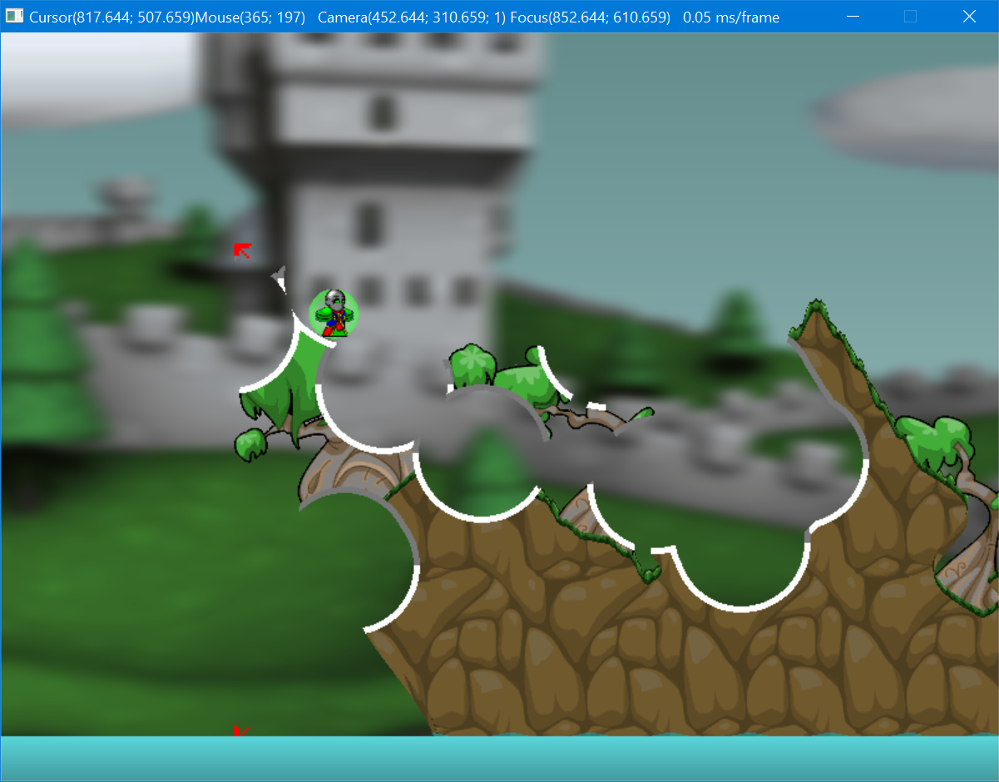

# Arcanists' Scribblings

## What is this

This is some code that I had written during my early programming days when learning C++ and graphics programming.  
The aim was to try to copy a game called [Arcanists](http://www.funorb.com/g=arcanistsmulti/info.ws?game=arcanistsmulti) and learn stuff on the way.  
This in no way to be used as good examples of anything, most of this was experimenting, just throwing things in and trying out the concepts.  
I've included only a few(6) sprites that were ripped and converted to .png directly from original game cache files. (Not going to post the rest or the tool online for obvious reasons)  
There's an executable in bin/Debug/.. so no need to compile, use run.bat or copy it to the root directory so it finds the required resources.

## What can be found here

This was coded in Code::Blocks, uses OpenGL rendering with stuff like color replacement and blur in shaders.  
There's parallax background with funky maths to support zooming, some experimental collision detection.  
The most fun part - destructible terrain. You can erase terrain and navigate it!

#### Controls

**Left mouse button**: erase terrain  
**Right mouse button**: place character at cursor location  
**Middle mouse button / WASD**: pan view/camera  
**Arrow keys**: move character left/right (sprites don't mirror, but circle color slightly changes)  
**Shift**: long jump  
**Ctrl**: high jump (also restores zoom to 1:1)

## License

All files are licensed under [MIT](LICENSE) license except where explicitly written otherwise inside file contents or for those noted below:  
All textures are copyright © Jagex Ltd.  
lodepng.(h/cpp) which are part of [LodePNG](http://lodev.org/lodepng/) project.  
glew.(h/c), glxew.h, wglew.h which are part of [OpenGL Extension Wrangler library](https://github.com/nigels-com/glew#copyright-and-licensing).  
SDL.dll which is part of [Simple DirectMedia Layer library](https://www.libsdl.org/license.php)
